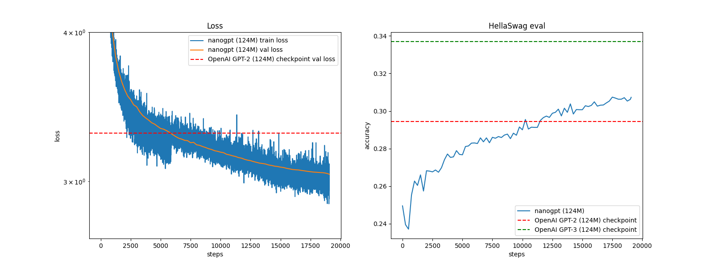

# My Very Own GPT-2

In this repository, you will find all the code files I used to follow along with Andrej Karpathy's *Zero to Hero* series—specifically the "Create Your Own GPT" video.

You can get further details and my notes on my blog [here](#).

The majority of the code is Karpathy's. I have only made a few minor modifications and left a bunch of comments for my own understanding or when referencing it at a later stage.

## My GPT-2 Performance in Comparison to OpenAI's GPT and HellaSwag Benchmark

## Code File Descriptions

- `dataset_fineweb.py` - Run this file first to download the Hugging Face FineWeb-Edu 10B dataset.
- `HellaSwag.py` - Run this file next to download the HellaSwag benchmark dataset.
- `gpt2_part1.ipynb` - This is the code from the first "Create Your GPT" video by Karpathy.
- `gpt2_train_cuda.py` - This is the full, beefed-up GPT-2 model with 124M parameters. We trained this on Lambda Labs using 8×A100 80GB GPUs.
- `results.py` - Generates the loss and HellaSwag benchmark plots.
- `generate.py` - Generates 50 tokens based on a given prompt.

### Log Directory

The `log` directory contains the training run metrics.